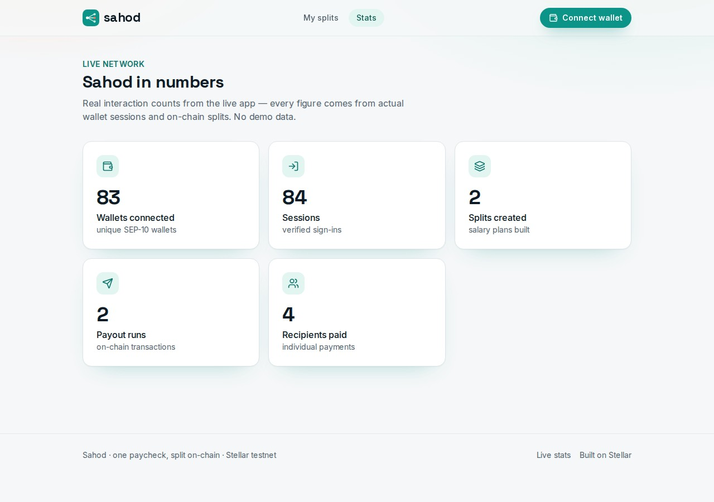
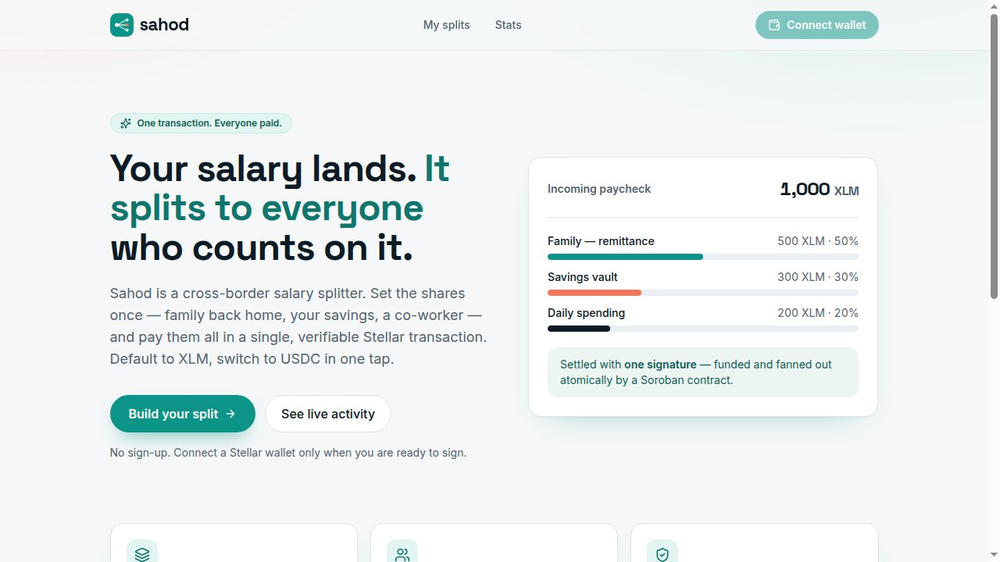
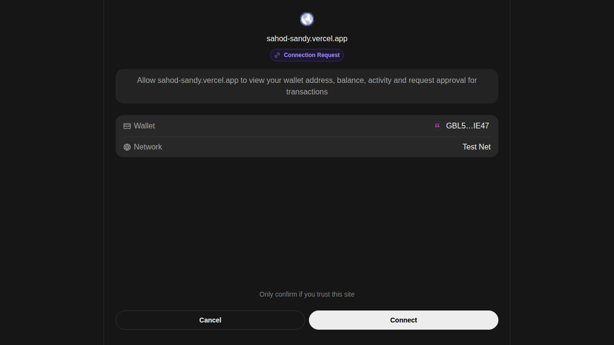
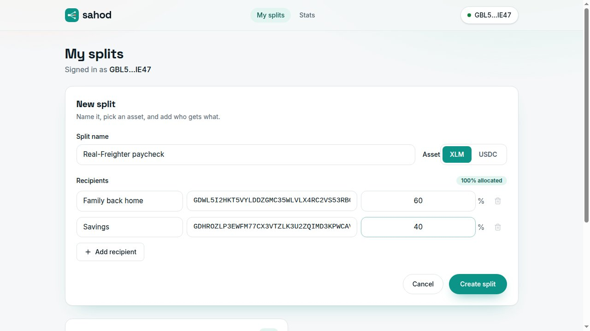
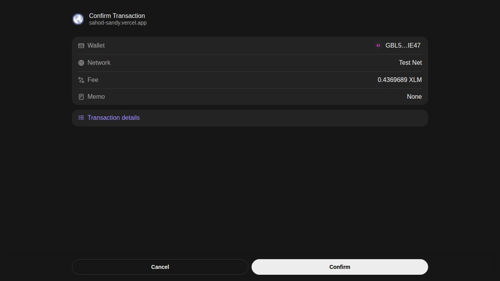
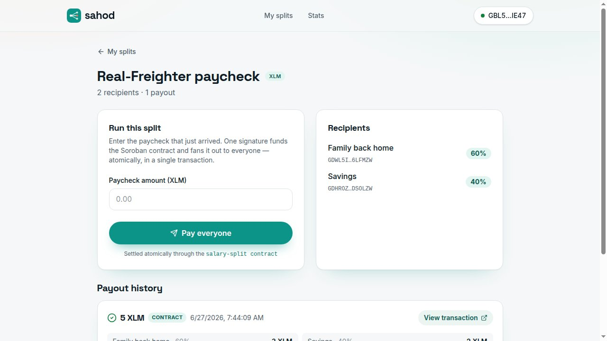

# sahod

**One paycheck in. Everyone who counts on it, paid at once — atomically, on-chain.**

Sahod is a cross-border salary splitter built on Stellar. An overseas worker's pay
rarely belongs to one person — part goes to family back home, part to savings, part
stays for daily life. Sahod turns that mental math into a single, verifiable on-chain
event: set the shares once, enter the paycheck that just arrived, sign one time, and a
**Soroban smart contract funds itself with the whole paycheck and fans it out to every
recipient in the same call**.

Live app: **https://sahod-sandy.vercel.app**

Salary-split contract (testnet):
[`CDZW27BK653JQ7JIC5RHQBGWYXW5PRZU2BBL7GHKVPBTDR4AUKMFBZ24`](https://stellar.expert/explorer/testnet/contract/CDZW27BK653JQ7JIC5RHQBGWYXW5PRZU2BBL7GHKVPBTDR4AUKMFBZ24)

---

## Why it's different

Most "splitter" demos fire off a payment per person and hope they all land. Sahod runs
the whole split **inside one Soroban contract invocation**. The payer signs once; the
contract pulls the full paycheck into its own custody and immediately pays every
recipient their share — pay-in and every payout in the same transaction. The split
clears completely or reverts completely. There is no half-sent paycheck, and the
contract never holds a float.

- **Atomic, contract-enforced payouts.** A 5-recipient split is one signature and one
  Soroban transaction. The on-chain guarantee is the contract, not a hopeful loop.
- **Immutable receipts.** Each run writes a permanent `SplitReceipt` keyed by a 32-byte
  reference, so the same run can never be paid twice and any auditor can read who funded
  what, when.
- **Real recipients only.** You add the actual Stellar addresses of the people you
  support. Sahod never invents names — the only identities shown come from the wallets
  you enter and the wallet you connect.

## How it works

1. **Connect** — SEP-10 challenge/response with your Stellar wallet (Freighter). Signing
   is pinned to **testnet**, so it works even if your wallet's active network is Mainnet.
   Browsing and the stats page need no wallet at all.
2. **Add recipients** — give each share a label and paste a Stellar address. Shares total 100%.
3. **Enter the paycheck** — pick **XLM** (default, no trustline needed) or **USDC**, and
   the amount that arrived. A live preview shows exactly what each recipient will get.
4. **Pay everyone** — the server builds the `pay_split` contract invocation, your wallet
   signs it once, and the server submits + polls Soroban RPC. The run is saved with its
   real transaction hash, linked to stellar.expert.

### The contract

The salary-split contract (Rust / `soroban-sdk` 22) exposes:

| Method | Auth | Effect |
|---|---|---|
| `initialize(admin, token)` | admin | one-time; records admin + the pool's SAC token (native XLM) |
| `pay_split(split_ref, payer, recipients, amounts)` | payer | **atomic**: pulls `sum(amounts)` from the payer into the contract, pays each recipient their share, writes a permanent receipt; returns the total |
| `get_receipt(split_ref)` / `is_paid(split_ref)` | view | read a receipt / check settlement |
| `total_paid()` / `total_splits()` | view | lifetime total + run count |
| `pause()` / `unpause()` / `set_admin()` / `upgrade()` | admin | operational controls |

Full deployment record (wasm hash, tx ids, reproduce steps): `contracts/DEPLOYMENT.md`.
The contract is covered by 10 Rust tests (`cd contracts && cargo +1.89.0 test`).

### Assets

- **XLM is the default** — it settles through the Soroban contract above. Native payments
  need no trustline, so any funded testnet wallet works out of the box.
- **USDC is opt-in** — a one-tap **Enable USDC** button builds and submits a `changeTrust`
  to the testnet USDC issuer. USDC splits settle on a classic multi-payment path that the
  server re-reads from Horizon before recording.

## Core flow is real on-chain

The "Pay everyone" button does not simulate anything. For an XLM split it constructs a
real `pay_split` Soroban invocation, has the connected wallet sign it, submits it to
Soroban RPC, and polls until it lands — then persists the run with the resulting hash.
Example verified split from the production e2e run:
`5 XLM → 3 XLM (60%) + 2 XLM (40%)` settled in a single contract call.

## Tech stack

- **Next.js 16** (App Router) + **React 19**, TypeScript
- **Soroban** smart contract (`soroban-sdk` 22, Rust 1.89) — the atomic salary split
- **Tailwind CSS v4** design tokens (jade + harbor navy on cool paper)
- **@stellar/stellar-sdk** (Soroban RPC + Horizon) + **@stellar/freighter-api** v6
- **Drizzle ORM** + **Postgres** (Supabase)
- **Vitest** unit tests · **Playwright** live-prod e2e

## Routes

| Route | What it is |
|---|---|
| `/` | Landing — what Sahod is, how a split runs |
| `/dashboard` | Your splits + the create-split form (wallet required) |
| `/splits/[id]` | A split: recipients, run panel, payout history |
| `/stats` | Public live interaction counts |
| `/api/auth/{challenge,verify,me,logout}` | SEP-10 session auth |
| `/api/splits`, `/api/splits/[id]` | Split CRUD |
| `/api/splits/[id]/runs/build` | Build the `pay_split` invoke XDR for the payer to sign |
| `/api/splits/[id]/runs` | Submit the signed split (contract or classic) + record the run |
| `/api/stats`, `/api/health` | Public stats + health |

## Quick start

```bash
pnpm install
cp .env.example .env.local          # set DRIZZLE_DATABASE_URL + a 32+ char SESSION_SECRET
pnpm db:push                         # create tables
pnpm dev                             # http://localhost:3003
```

Contract (optional — already deployed to testnet):

```bash
cd contracts
cargo +1.89.0 test                                   # 10 passed; 0 failed
cargo +1.89.0 build --release --target wasm32-unknown-unknown
stellar contract optimize --wasm target/wasm32-unknown-unknown/release/salary_split.wasm
# deploy + initialize: see contracts/DEPLOYMENT.md
```

Testing:

```bash
pnpm test                                            # unit tests
PLAYWRIGHT_BASE_URL=https://sahod-sandy.vercel.app \
  pnpm test:e2e                                       # live on-chain e2e through the contract
```

## Environment

| Var | Purpose |
|---|---|
| `DRIZZLE_DATABASE_URL` | Postgres connection string |
| `SESSION_SECRET` | 32+ char secret for sessions |
| `NEXT_PUBLIC_STELLAR_NETWORK` | `testnet` — the network signing is pinned to |
| `STELLAR_HORIZON_URL` | Horizon endpoint (classic USDC path) |
| `SOROBAN_RPC_URL` | Soroban RPC endpoint (contract path) |
| `SOROBAN_SALARY_SPLIT_CONTRACT_ID` | The deployed salary-split contract id |
| `SALARY_SPLIT_ADMIN_PUBLIC_KEY` | Contract admin / deployer public key |
| `NATIVE_SAC_ID_TESTNET` | Native XLM Stellar Asset Contract id (the pool token) |
| `USDC_ASSET_ISSUER_TESTNET` | Testnet USDC issuer for the Enable-USDC trustline |
| `NEXT_PUBLIC_APP_URL` | Public base URL of the deployment |

## Live stats

Counts pulled from `GET /api/stats` on the live deployment. Demo and test wallets are excluded so the numbers mean something — no inflated "users onboarded."



| Field | Value |
|---|---|
| Unique wallets | 83 |
| Logins | 84 |
| Total splits | 2 |
| Payout runs | 2 |
| Recipients paid | 4 |

## Screenshots

Captured from the live deployment during the Playwright run.

| | |
|---|---|
|  |  |
|  |  |
|  |  |

Mobile: `screen-shot/07-mobile.jpg`

---

Built on Stellar testnet. Money is real on-chain value; everything else is yours.
